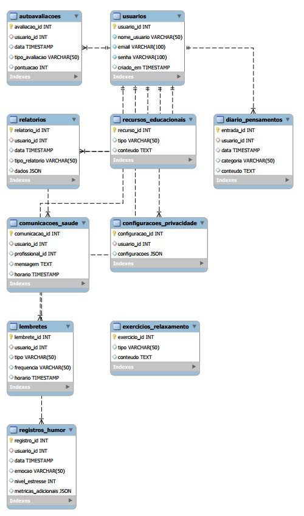

<div align="center">
  
  
  # MindCare 🧠💚
  
  **Aplicativo de Cuidados com a Saúde Mental e Bem-estar**
  
  
  
  
  
  
  **© 2025 Katiane Margiotti Soares. Todos os direitos reservados.**
  
</div>

---

## 📋 Sumário

- [📱 Sobre o Projeto](#-sobre-o-projeto)
- [✨ Funcionalidades](#-funcionalidades)
- [🚀 Tecnologias Utilizadas](#-tecnologias-utilizadas)
- [📦 Backlog do Produto](#-backlog-do-produto)
- [📊 Relatório de Entregas](#-relatório-de-entregas)
- [🎨 Protótipo Navegável](#-protótipo-navegável)
- [🗄️ Modelo de Dados](#️-modelo-de-dados)
- [⚙️ Como Executar o Projeto](#️-como-executar-o-projeto)
- [📄 Licença e Direitos Autorais](#-licença-e-direitos-autorais)
- [👩‍💻 Desenvolvedora](#-desenvolvedora)
- [📞 Contato](#-contato)

---

## 📱 Sobre o Projeto

O **MindCare** é uma aplicação móvel inovadora desenvolvida com React Native e Expo, especialmente projetada para promover o cuidado da saúde mental e bem-estar emocional. O aplicativo oferece uma abordagem holística para o autocuidado, combinando tecnologia moderna com práticas comprovadas de bem-estar mental.

### 🎯 Objetivo
Fornecer uma plataforma digital acessível e intuitiva que empodere os usuários a cuidarem ativamente de sua saúde mental, oferecendo ferramentas práticas, recursos educacionais e suporte personalizado.

---

## ✨ Funcionalidades

### 🧘‍♀️ **Bem-estar e Relaxamento**
- Exercícios de meditação guiada
- Técnicas de respiração e relaxamento
- Sessões de musicoterapia
- Práticas de mindfulness

### 📊 **Monitoramento e Acompanhamento**
- Registro diário de humor e emoções
- Acompanhamento do estado emocional
- Relatórios e gráficos personalizados
- Histórico de progresso

### 💬 **Suporte e Comunicação**
- Chat de apoio com profissionais
- Grupos de suporte virtual
- Sistema de notificações personalizadas
- Lembretes de autocuidado

### 📚 **Educação e Recursos**
- Conteúdo educativo sobre saúde mental
- Artigos e dicas de bem-estar
- Recursos de autoajuda
- Biblioteca de exercícios terapêuticos

### 📝 **Reflexão e Journaling**
- Diário de pensamentos e sentimentos
- Prompts de reflexão diária
- Ferramentas de autoavaliação
- Exercícios de gratidão

---

## 🚀 Tecnologias Utilizadas

### **Frontend**
- 
- 
- 

### **Backend e Database**
- 
- 
- 

### **Navegação e Interface**
- 
- 
- 

### **Ferramentas de Desenvolvimento**
- 
- 
- 

---

## 📦 Backlog do Produto

| ID  | Sprint | Categoria | Tarefa | Status |
|:---:|:------:|:---------:|:------:|:------:|
| 01  | Kick-off | Frontend  | Criação do mockup do projeto no Figma | ✅ |
| 02  | Kick-off | Frontend  | Conversão do mockup em protótipo navegável | ✅ |
| 03  | 1 | Backend | Desenvolvimento da API para registro de humor | ✅ |
| 04  | 1 | Backend | Desenvolvimento da API para diário de pensamentos | ✅ |
| 05  | 1 | Frontend | Implementação da interface de registro de humor | ✅ |
| 06  | 1 | Frontend | Implementação da interface do diário de pensamentos | ✅ |
| 07  | 2 | Backend | Desenvolvimento da API para exercícios de relaxamento | ✅ |
| 08  | 2 | Backend | Desenvolvimento da API para recursos educacionais | ✅ |
| 09  | 2 | Frontend | Implementação da interface de exercícios de relaxamento | ✅ |
| 10  | 2 | Frontend | Implementação da interface de recursos educacionais | ✅ |
| 11  | 3 | Backend | Desenvolvimento da API para autoavaliação | ✅ |
| 12  | 3 | Backend | Desenvolvimento da API para relatórios e gráficos | ✅ |
| 13  | 3 | Frontend | Implementação da interface de autoavaliação | ✅ |
| 14  | 3 | Frontend | Implementação da interface de relatórios e gráficos | ✅ |
| 15  | 4 | Backend | Desenvolvimento da API para comunicação com profissionais | ✅ |
| 16  | 4 | Backend | Desenvolvimento da API para configurações de perfil | ✅ |
| 17  | 4 | Backend | Desenvolvimento da API para notificações | ✅ |
| 18  | 4 | Frontend | Implementação da interface de comunicação com profissionais | ✅ |
| 19  | 4 | Frontend | Implementação da interface de configurações de perfil | ✅ |
| 20  | 4 | Frontend | Implementação da interface de notificações | ✅ |

---

## 📊 Relatório de Entregas

| Sprint | Período | Status | Entregáveis | Relatório |
|:-----:|:----------:|:---------:|:-----------:|:---------:|
| **Kick-off** | 02/09/2024 - 09/09/2024 | ✅ Concluído | Mockup e Protótipo | [Ver detalhes](#kick-off) |
| **Sprint 1** | 09/09/2024 - 29/09/2024 | ✅ Concluído | Registro de Humor e Diário | [Ver relatório](https://github.com/Katianefatec/MindCare/tree/sprint-1) |
| **Sprint 2** | 04/10/2024 - 25/10/2024 | ✅ Concluído | Exercícios e Recursos | [Ver relatório](https://github.com/Katianefatec/MindCare/tree/sprint-2) |
| **Sprint 3** | 26/10/2024 - 15/11/2024 | ✅ Concluído | Autoavaliação e Relatórios | [Ver relatório](https://github.com/Katianefatec/MindCare/tree/sprint-3) |
| **Sprint 4** | 15/11/2024 - 06/12/2024 | ✅ Concluído | Comunicação e Perfil | [Ver relatório](https://github.com/Katianefatec/MindCare/tree/sprint-4) |

---

## 🎨 Protótipo Navegável

<div align="center">
  
[](https://www.figma.com/proto/gaXVVA2U5GE9fN5eV7eZlH/MindCare?node-id=202-4&node-type=FRAME&t=VeZMjJBzqGrUvI4Y-1&scaling=scale-down&content-scaling=fixed&page-id=0%3A1&starting-point-node-id=223%3A58)

**[🔗 Acesse o Protótipo Interativo no Figma](https://www.figma.com/proto/gaXVVA2U5GE9fN5eV7eZlH/MindCare?node-id=202-4&node-type=FRAME&t=VeZMjJBzqGrUvI4Y-1&scaling=scale-down&content-scaling=fixed&page-id=0%3A1&starting-point-node-id=223%3A58)**

</div>

---

## 🗄️ Modelo de Dados

<div align="center">
  
  
  **Modelo Lógico do Banco de Dados - MindCare**
</div>

### Estrutura Principal:
- **Users**: Informações dos usuários
- **Mood_Logs**: Registros de humor diário
- **Reflections**: Reflexões e journaling
- **Assessments**: Autoavaliações
- **Notifications**: Sistema de notificações

---

## ⚙️ Como Executar o Projeto

### 📋 Pré-requisitos

- Node.js (versão 18 ou superior)
- npm ou yarn
- Expo CLI
- Android Studio ou Xcode (para emuladores)
- Dispositivo físico com Expo Go (opcional)

### 🚀 Instalação

1. **Clone o repositório**
   ```bash
   git clone https://github.com/Katianefatec/MindCare.git
   cd MindCare
   ```

2. **Instale as dependências**
   ```bash
   npm install
   ```

3. **Configure o Firebase**
   - Crie um projeto no [Firebase Console](https://console.firebase.google.com/)
   - Configure Authentication e Firestore
   - Adicione as configurações no arquivo `config/firebaseConfig.ts`

4. **Execute o projeto**
   ```bash
   npx expo start
   ```

5. **Abra no dispositivo**
   - Use o Expo Go para escanear o QR code
   - Ou execute em emulador Android/iOS

### 📱 Gerando APK

```bash
# Instalar EAS CLI
npm install -g @expo/cli

# Login no Expo
npx expo login

# Gerar APK
npx eas build --platform android --profile preview
```

---

## 📄 Licença e Direitos Autorais

### 🔒 **Licença Proprietária**

**Copyright © 2025 Katiane Margiotti Soares**  
**Todos os direitos reservados.**

Este software é protegido por direitos autorais e está licenciado sob uma **Licença Proprietária**.

#### ✅ **Usos Permitidos:**
- Uso pessoal e educacional
- Estudo do código fonte
- Modificações para uso próprio
- Contribuições via pull request

#### ❌ **Usos Proibidos:**
- **Uso comercial sem autorização expressa**
- Redistribuição sem créditos
- Venda ou sublicenciamento
- Criação de produtos derivados para fins comerciais

#### 💼 **Licenciamento Comercial**
Para uso comercial, licenciamento ou parcerias comerciais, entre em contato através dos canais oficiais.

> **⚠️ Aviso Legal:** Qualquer uso comercial não autorizado deste software resultará em ação legal. O uso comercial requer autorização prévia e pagamento de royalties.

---

## 👩‍💻 Desenvolvedora

<div align="center">
  
### **Katiane Margiotti Soares**

**Desenvolvedora Full Stack | Especialista em React Native | UX/UI Designer**

[](https://linkedin.com/in/katiane-soares)
[](https://github.com/Katianefatec)
[](mailto:katy_ane@yahoo.com.br)

**Sobre a Desenvolvedora:**
- 🎓 Formada em Análise e Desenvolvimento de Sistemas
- 💻 Especialista em desenvolvimento mobile com React Native
- 🎨 Designer UX/UI com foco em aplicações de saúde mental
- 🧠 Apaixonada por tecnologias que promovem bem-estar

</div>

---

## 📞 Contato

### 💼 **Para Licenciamento Comercial:**
- **Email:** katy_ane@yahoo.com.br
- **Assunto:** "Licenciamento Comercial - MindCare"

### 🐛 **Para Reportar Bugs:**
- Abra uma [issue no GitHub](https://github.com/Katianefatec/MindCare/issues)

### 💡 **Para Sugestões:**
- Use as [Discussions do GitHub](https://github.com/Katianefatec/MindCare/discussions)

---

<div align="center">
  
### 🌟 **Se este projeto te ajudou, considere dar uma estrela!** ⭐

**Desenvolvido com 💚 por Katiane Margiotti Soares**

[](./LICENSE)
[](./package.json)
[]()

---

**© 2025 Katiane Margiotti Soares. Todos os direitos reservados.**

</div>
